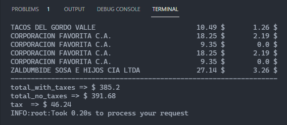

# SriInvoiceProcessing

A small python tool to get relevant values from SRI invoices

## Some useful info to run the tool

Login into your SRI account and retrieve all the XML invoice files from the period you want to process.

### Installing dependencies

You will need [Python 3.8.x](https://www.python.org/downloads/release/python-3812/) to run this tool

- Install virtualenv with pip -> `pip install virtualenv`
- Create a new virtualenv on the project folder with -> `virtualenv venv`
- Activate the virtual environment with `source venv/bin/activate` on any nix-like OS or `venv\Scripts\activate` in windows
- Install the dependencies with -> `pip install -r requirements.txt`

### Running the tool

In the root folder of the project (after activating your virtual env and installing the dependencies):

- Create a new folder called `invoices`
- Place all the xml files you downloaded in that folder
- run `python main.py`
- Or run `python main.py -p your/path/to/invoices` to provide a custom path to your invoice folder

## The results

The results are organized in two parts: a breakdown of all your invoices and a summary with the relevant values

Some invoices contain two parts, which in the summary is shown as a two separate invoices, a taxable and a non-taxable amount, the interesting part is the taxable amount, which is the one that has a 12% added value tax.

In the summary you can find the total tax value, and the total value that has taxes, ussually you only need the `total_with_taxes` value, to add that in your tax declaration.

All other values are there for your information and so you can check the calculation is correct.

I hope you find this useful and helps you deduct taxes faster.
